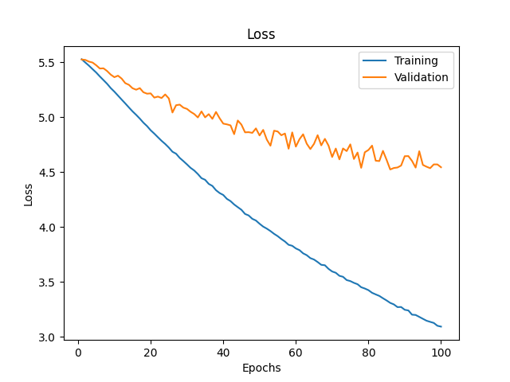
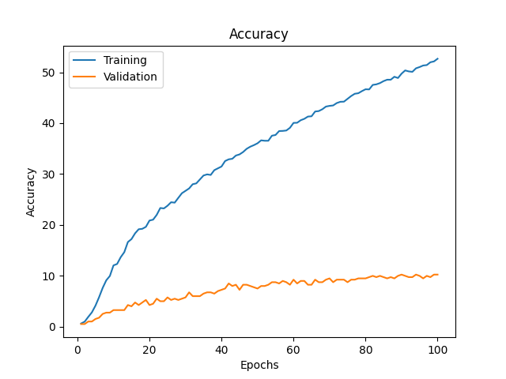
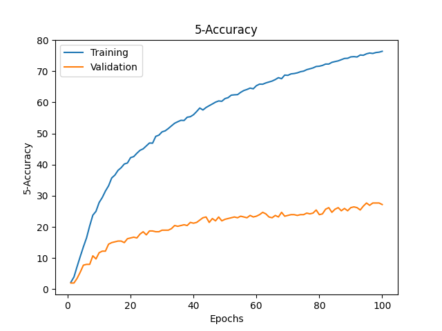
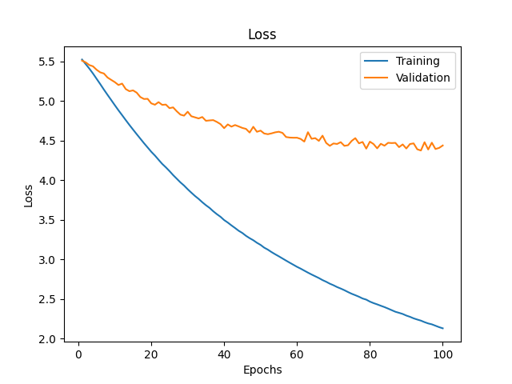
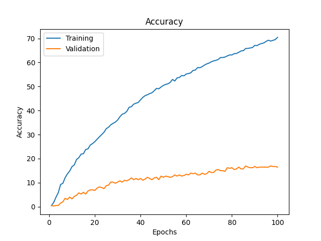
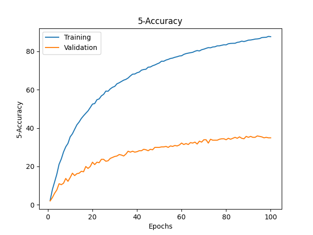

## Transfer Learning con ultimi 2 strati:

### Machine Learning

Linear Support Vector obtained following accuracy: 0.0946215139442231
Rbf Support Vector obtained following accuracy: 0.17330677290836655
KNN with 1 neighbors obtained following accuracy: 0.10657370517928287
KNN with 10 neighbors obtained following accuracy: 0.11254980079681275
KNN with 20 neighbors obtained following accuracy: 0.11653386454183266
KNN with 50 neighbors obtained following accuracy: 0.12649402390438247
Naive Bayes obtained following accuracy: 0.1145418326693227

### Finetune

100 Epochs-128 b size:

Test set results:

Accuracy: 17.52988047808765 %
5-Accuracy: 36.15537848605578 %
CM filename: ./Transfer_Learning/model_metrics/ConfM_finetunedGoogLeNet_minus1_100e_128bsize_80_20_split.npy
Model saved at: ./Storage/models/Neural_models/finetunedGoogLeNet_minus1_100e_128bsize_80_20_split.pth

Plots:

100 Epochs-64 b size:

Test set results:

Accuracy: 17.131474103585656 %
5-Accuracy: 37.05179282868526 %
CM filename: ./Transfer_Learning/model_metrics/ConfM_finetunedGoogLeNet_minus1_100e_64bsize_80_20_split.npy
Model saved at: ./Storage/models/Neural_models/finetunedGoogLeNet_minus1_100e_64bsize_80_20_split.pth

Plots:

