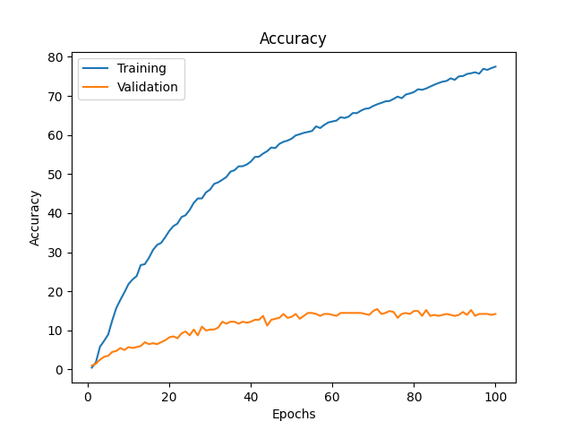
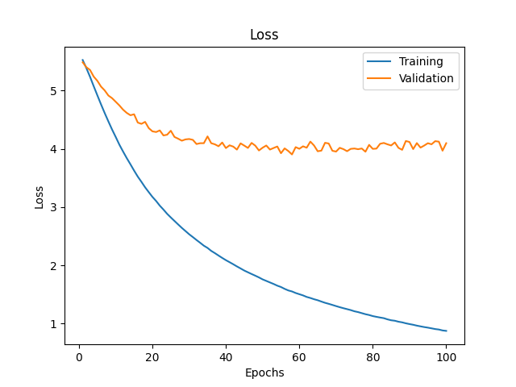

## Transfer Learning con ultimi 2 strati:

### Machine Learning

### Finetune

100 Epochs-128 b size:

Test set results:

Accuracy: 17.729083665338646 %
5-Accuracy: 39.14342629482071
CM filename: ./Transfer_Learning/model_metrics/ConfM_finetunedResNet50_minus1_100e_128bsize_80_20_split.npy
Model saved at: ./Storage/models/Neural_models/finetunedResNet50_minus1_100e_128bsize_80_20_split.pth

Plots:

100 Epochs-64 b size:

Test set results:

Accuracy: 18.227091633466134 %
5-Accuracy: 39.14342629482071
CM filename: ./Transfer_Learning/model_metrics/ConfM_finetunedResNet50_minus1_100e_64bsize_80_20_split.npy
Model saved at: ./Storage/models/Neural_models/finetunedResNet50_minus1_100e_64bsize_80_20_split.pth

Plots:

### Food dataset:

100 Epochs-128 b size:

Test set results:

Accuracy: 21.41434262948207 %
5-Accuracy: 43.92430278884462
CM filename: ./Transfer_Learning/model_metrics/ConfM_finetunedResNet50_minus1_100e_128bsize_80_20_splitfood_dataset.npy
Model saved at: ./Storage/models/Neural_models/finetunedResNet50_minus1_100e_128bsize_80_20_splitfood_dataset.pth

Plots:

100 Epochs-64 b size:

Test set results:

Accuracy: 21.41434262948207 %
5-Accuracy: 43.92430278884462
CM filename: ./Transfer_Learning/model_metrics/ConfM_finetunedResNet50_minus1_100e_128bsize_80_20_splitfood_dataset.npy
Model saved at: ./Storage/models/Neural_models/finetunedResNet50_minus1_100e_128bsize_80_20_splitfood_dataset.pth

Plots:

100 Epochs 64 size only last layer:

Accuracy: 0.49800796812749004 %
5-Accuracy: 2.2908366533864544
CM filename: ./Transfer_Learning/model_metrics/ConfM_finetunedResNet50_minus1_100e_64bsize_80_20_split_food_dataset_onlyone.npy
Model saved at: ./Storage/models/Neural_models/finetunedResNet50_minus1_100e_64bsize_80_20_split_food_dataset_onlyone.pth

