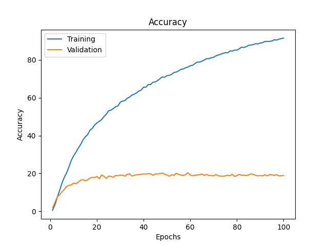

## Transfer Learning con ultimi 2 strati:

### Machine Learning

Linear Support Vector obtained following accuracy: 11.752988047808766 %
Rbf Support Vector obtained following accuracy: 19.42231075697211 %
KNN with 1 neighbors obtained following accuracy: 11.055776892430279 %
KNN with 10 neighbors obtained following accuracy: 10.258964143426295 %
KNN with 20 neighbors obtained following accuracy: 12.250996015936255 %
KNN with 50 neighbors obtained following accuracy: 12.350597609561753 %
Naive Bayes obtained following accuracy: 13.44621513944223 %

### Finetune

100 Epochs-128 b size:

Test set results:

Accuracy: 17.729083665338646 %
5-Accuracy: 39.14342629482071
CM filename: ./Transfer_Learning/model_metrics/ConfM_finetunedResNet50_minus1_100e_128bsize_80_20_split.npy
Model saved at: ./Storage/models/Neural_models/finetunedResNet50_minus1_100e_128bsize_80_20_split.pth

Plots:

100 Epochs-64 b size:

Test set results:

Accuracy: 18.92430278884462 %
5-Accuracy: 40.1394422310757
CM filename: ./Transfer_Learning/model_metrics/ConfM_finetunedResNet50_minus1_100e_64bsize_80_20_split.npy
Model saved at: ./Storage/models/Neural_models/finetunedResNet50_minus1_100e_64bsize_80_20_split.pth

Plots:

60 Epochs-64 b size:

Test set results:

Accuracy: 19.42231075697211 %
5-Accuracy: 39.8406374501992
CM filename: ./Transfer_Learning/model_metrics/ConfM_finetunedResNet50_minus1_60e_64bsize_80_20_split.npy
Model saved at: ./Storage/models/Neural_models/finetunedResNet50_minus1_60e_64bsize_80_20_split.pth

Plots:

40 Epochs-64 b size:

Test set results:

Accuracy: 18.326693227091635 %
5-Accuracy: 40.438247011952186
CM filename: ./Transfer_Learning/model_metrics/ConfM_finetunedResNet50_minusnessuno_40e_64bsize_80_20_split.npy
Model saved at: ./Storage/models/Neural_models/finetunedResNet50_minusnessuno_40e_64bsize_80_20_split.pth

Plots:

### Food dataset:

100 Epochs-128 b size:

Test set results:

Accuracy: 21.41434262948207 %
5-Accuracy: 43.92430278884462
CM filename: ./Transfer_Learning/model_metrics/ConfM_finetunedResNet50_minus1_100e_128bsize_80_20_splitfood_dataset.npy
Model saved at: ./Storage/models/Neural_models/finetunedResNet50_minus1_100e_128bsize_80_20_splitfood_dataset.pth

Plots:

100 Epochs-64 b size:

Test set results:

Accuracy: 21.41434262948207 %
5-Accuracy: 43.92430278884462
CM filename: ./Transfer_Learning/model_metrics/ConfM_finetunedResNet50_minus1_100e_128bsize_80_20_splitfood_dataset.npy
Model saved at: ./Storage/models/Neural_models/finetunedResNet50_minus1_100e_128bsize_80_20_splitfood_dataset.pth

Plots:

100 Epochs 64 size only last layer:

Accuracy: 0.49800796812749004 %
5-Accuracy: 2.2908366533864544
CM filename: ./Transfer_Learning/model_metrics/ConfM_finetunedResNet50_minus1_100e_64bsize_80_20_split_food_dataset_onlyone.npy
Model saved at: ./Storage/models/Neural_models/finetunedResNet50_minus1_100e_64bsize_80_20_split_food_dataset_onlyone.pth

Accuracy: 24.4 %
5-Accuracy: 47.8
CM filename: ./Transfer_Learning/model_metrics/ConfM_finetunedResNet50_minusnessuno_10e_64bsize_80_20_split_dataset_degraded_train_whole.npy
Model saved at: ./Storage/models/Neural_models/finetunedResNet50_minusnessuno_10e_64bsize_80_20_split_dataset_degraded_train_whole.pth

Accuracy: 23.107569721115535 %
5-Accuracy: 45.41832669322709
CM filename: ./Transfer_Learning/model_metrics/ConfM_10e_64bsize_80_20_split_dataset_degraded_from_previous_weights.npy
Model saved at: ./Storage/models/Neural_models/10e_64bsize_80_20_split_dataset_degraded_from_previous_weights.pth

