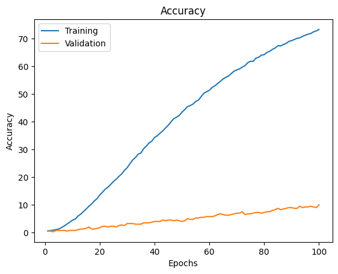
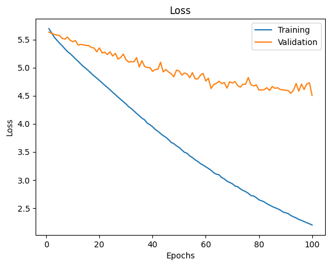
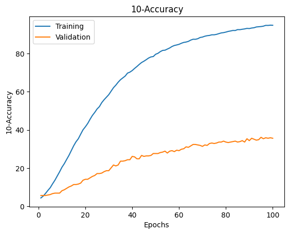

## Transfer Learning con ultimi 2 strati:

### Machine Learning

With PCA, first 500 principal components:

- Linear Support Vector obtained following accuracy: 0.07569721115537849
- Rbf Support Vector obtained following accuracy: 0.11354581673306773
- KNN with 1 neighbors obtained following accuracy: 0.05876494023904383
- KNN with 10 neighbors obtained following accuracy: 0.0697211155378486
- KNN with 20 neighbors obtained following accuracy: 0.05776892430278884
- KNN with 50 neighbors obtained following accuracy: 0.07370517928286853
- Naive Bayes obtained following accuracy: 0.07868525896414343

### Finetune

100 Epochs:

Accuracy: 0.11055776892430279

10-Accuracy: 38.645418326693225

Plots:

